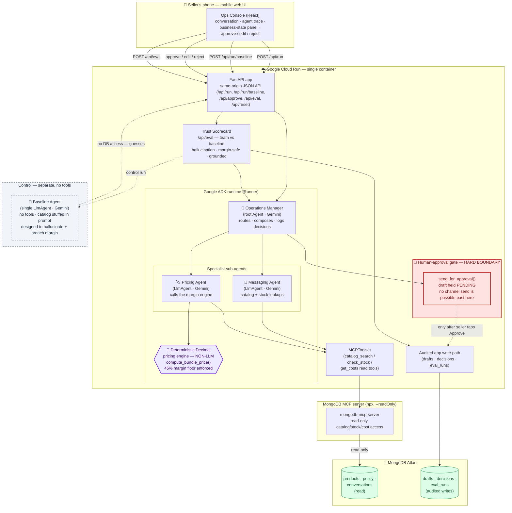

# Asili Operations Team — Architecture

> **The one-line thesis:** *Asili is the AI operations team that can prove it never lied.*
> Every customer-facing answer is grounded in the seller's **live MongoDB Atlas catalog** (read through the MongoDB MCP server in `--readOnly` mode), every price comes from a **deterministic Decimal margin engine** (never the LLM), and **nothing sends without the seller's one-tap approval**. A **Trust Scorecard** runs adversarial scenarios through the multi-agent team and a deliberately-naive single-agent baseline, and scores hallucination, margin-safety, and groundedness.

This document describes the runtime honestly: the diagram below is the architecture the system is built around, and the [Implementation status](#implementation-status-honest-runtime-notes) section spells out exactly what is wired today versus the MongoDB MCP / Atlas grounding path it is designed to drop into.

---

## Runtime topology

**How to read the diagram, in one breath:** the seller's phone talks to one Cloud Run container. Inside it, the **Operations Manager** routes the customer's question to the **Messaging** and **Pricing** specialists. Messaging and Pricing read catalog facts through an **MCPToolset → MongoDB MCP server (`--readOnly`) → Atlas**, so they cannot invent inventory. Pricing never does arithmetic itself — it hands quantities to the **deterministic Decimal engine** (the violet, non-LLM box), which enforces the 45% margin floor. The composed reply stops at the **red approval gate**: nothing reaches a customer channel until the seller taps Approve. Every approved draft, decision, and eval run is written back to Atlas on the **audited write path**. The **Baseline agent** (dashed, grey) is a deliberately crippled single agent with no tools — it's the control the Trust Scorecard measures against.

---

## Components

### Phone web UI — the Ops Console
A mobile-first React console (the design lives in `design_handoff_ops_console/`). It shows three things side by side: the **customer conversation**, the **agent activity trace** (each routing / grounding / pricing / compose step with its reasoning), and a **business-state panel** of grounded facts (product, unit price, unit cost, unit margin vs. floor, stock level, bundle price). The seller's only actions are **Approve / Edit / Reject**. The UI is same-origin with the API, so there is no CORS dance in production and no second service to deploy.

### Cloud Run — FastAPI + ADK runtime
One container (`Dockerfile`, `uvicorn asili_agents.api.main:app`, port 8080) hosts both the JSON API and the Google ADK runtime. Auto-deploys to Cloud Run reusing the existing XPRIZE GCP project and shared Workload Identity Federation. The relevant endpoints:

| Endpoint | Purpose |
| --- | --- |
| `GET /` | service / version / status |
| `GET /api/seller`, `/api/products`, `/api/policy`, `/api/facts` | grounded read models for the UI |
| `GET /api/conversations/{id}`, `POST /api/conversations` | conversation state |
| `POST /api/run` | run the **multi-agent team**; returns steps, draft, facts |
| `POST /api/run/baseline` | run the **no-tools control** for comparison |
| `POST /api/approve` | approve / edit / reject a pending draft (the gate) |
| `GET /api/pending/{id}` | is there a draft awaiting approval? |
| `POST /api/eval` | run the **Trust Scorecard** (team vs. baseline) |
| `POST /api/reset` | reset demo state |

`/api/run` runs the synchronous ADK runner in a worker thread (`asyncio.to_thread`) so the agent's internal `asyncio.run()` doesn't collide with FastAPI's event loop.

### Operations Manager — the root Agent
A Gemini-backed ADK `Agent` (`agents/operations_manager.py`) that coordinates but is **not** the expert. Its instruction is explicit: it does **not** invent product details or prices — it routes product questions to Messaging, routes bundle/pricing questions to Messaging (for catalog data) then Pricing, composes the specialists' findings into one on-brand reply, logs each decision via `log_decision`, and **always** finishes by calling `send_for_approval`. It carries only two tools (`log_decision`, `send_for_approval`) and two sub-agents (Messaging, Pricing).

### Messaging Agent — catalog grounding
A Gemini `LlmAgent` (`agents/messaging.py`) whose core rule is "**never** mention a product without `catalog_search`, **never** state availability without `check_stock`." Those tools resolve against the seller's catalog (via MCP → Atlas), so the Messaging agent physically cannot report stock it hasn't read. It logs a `ground` step listing the fact IDs it verified, which the UI highlights in the business-state panel.

### Pricing Agent — the deterministic margin engine
A Gemini `LlmAgent` (`agents/pricing.py`) whose first rule is "**never** calculate prices yourself." It calls `get_costs` to read cost/margin, then `compute_bundle_price(items, margin_floor)` — and that function is the heart of the trust story. `compute_bundle_price` (`tools/pricing.py`) is plain Python with `decimal.Decimal` arithmetic, **no LLM involved**:

- It sums line prices and line costs exactly.
- It computes the minimum price that holds the margin floor: `min_price = total_cost / (1 - margin_floor)`.
- The bundle price is `max(discounted_price, min_price_for_margin)` — so a discount that would breach the floor is silently clamped **up** to the floor.
- It rounds to the cent with `ROUND_HALF_UP` and returns `is_margin_safe`, the actual `margin_percent`, and a human-readable `rationale`.

Because the floor is enforced by a `max()` over Decimals rather than by a prompt, the team **cannot** quote below margin even if the LLM "wanted" to.

### MCPToolset → MongoDB MCP server (`--readOnly`) → Atlas
Grounding reads flow through an MCPToolset to the `mongodb-mcp-server` (launched via `npx`, `--readOnly`) which holds the only connection to **MongoDB Atlas**. Read-only at the MCP layer is a hard guarantee: even a confused or adversarial agent cannot mutate the catalog, drop a collection, or write a price. The catalog (`products`), business rules (`policy`), and `conversations` are read here; `pymongo` and `mcp` are already declared dependencies in `pyproject.toml`.

### Human-approval gate — the hard boundary
`send_for_approval` (`tools/channel.py`) is the only path toward a customer, and it does **not** send — it parks the draft as `PENDING` and returns. The actual decision happens out-of-band when the seller hits `POST /api/approve` with `approve`, `edit`, or `reject`. Only on approve/edit does the message get appended to the conversation as `OUTBOUND`/`SENT`. There is no code path from an agent to a live channel that bypasses this gate — that's why it's drawn as a wall, not an arrow.

### Audited app write path → Atlas
Writes are a separate, narrow channel from reads. The application — not the read-only MCP path — performs audited writes of **drafts**, **decisions** (the agent reasoning trace from `log_decision`), and **eval_runs** (Trust Scorecard results) to Atlas. Keeping writes out of the MCP grounding path is deliberate: the thing the agents read from can never be the thing they write to.

### Baseline Agent — the no-tools control
`agents/baseline.py` is a single Gemini `LlmAgent` with `tools=[]` and the catalog stuffed into its prompt as plain text. It is **designed to fail**: no `check_stock` (so it hallucinates inventory), no `compute_bundle_price` (so it free-hands discounts below margin), no `catalog_search` (so it invents details). It exists purely as the control the Trust Scorecard scores the real team against — it is never on the customer path.

---

## Data flow: the demo question

Customer Dana asks, on the storefront chat: **"Do you have the purple tea in stock? Can you do a bundle?"**

1. **UI → `POST /api/run`** with the conversation id. FastAPI builds the runner with the seller, products, and policy.
2. **Operations Manager routes.** It recognizes a product question *and* a bundle question, logs a `route` step, and delegates: Messaging first (for catalog truth), then Pricing.
3. **Messaging grounds.** `catalog_search("purple tea")` finds `MH-PRP-50 · Purple Tea`. `check_stock` reads **6 tins, level `low`** straight from Atlas via MCP. It logs a `ground` step citing `product` and `stock`.
4. **Pricing computes — deterministically.** `get_costs` reads price `$18.00`, cost `$7.40`. `compute_bundle_price` for 2 tins computes regular `$36.00`, applies the 5% bundle intent, checks it against the floor, and returns a margin-safe bundle around **$34.00 at ~57% margin**, `is_margin_safe = true`. It logs a `compute` step.
5. **Operations Manager composes** one warm, on-brand reply: yes, Purple Tea is in stock (6 tins, running low), and a 2-tin bundle is ~$34. It logs a `compose` step and calls `send_for_approval` with sources like `["Catalog · Purple Tea", "Stock · 6 tins", "Pricing policy · floor 45%"]`.
6. **The gate holds.** The draft sits `PENDING`. The UI shows it next to the grounded facts. The seller taps **Approve** → `POST /api/approve` → the message is appended `OUTBOUND`/`SENT` and the draft + decisions are written to Atlas on the audited path.

Run the **same** question through `POST /api/run/baseline` and the control lies: it confidently claims something like *"32 tins in stock, 30% off — $25.20"* — **hallucinated inventory** and a **margin breach** (well under the 45% floor). That side-by-side contrast is the entire pitch.

---

## Why this prevents hallucination and margin breaches

Two failure modes sink naive seller-bots: **inventing stock** and **quoting below cost+margin**. Asili removes both at the architecture level, not by prompting harder.

- **No invented stock.** The Messaging agent's only route to availability data is `check_stock` → MCPToolset → MongoDB MCP server (`--readOnly`) → Atlas. It has no other source of inventory numbers, so a stock claim is either a read of the live catalog or it doesn't happen. `--readOnly` additionally guarantees a confused agent can't corrupt the very data it's grounding on.
- **No below-margin quotes.** Pricing is forbidden from doing arithmetic and must call `compute_bundle_price`, where the 45% floor is enforced by a `max()` over `Decimal` values. The LLM contributes intent ("offer a bundle"); the floor is math. You cannot prompt-inject your way past a `max()`.
- **No silent send.** Even a perfect draft cannot reach a customer without the seller's tap. The approval gate converts the LLM from an autonomous sender into a drafting assistant.
- **Everything is auditable.** Every routing, grounding, and pricing decision is logged and written to Atlas, so any answer can be replayed back to the exact facts and the exact deterministic computation that produced it. That is what "the AI ops team that can prove it never lied" means concretely.

---

## The Trust Scorecard (`POST /api/eval`)

The Trust Scorecard turns the trust claim into a number. It runs a battery of **adversarial scenarios** — questions engineered to tempt a model into hallucinating stock or discounting below margin — through **both** the multi-agent team and the no-tools baseline, then scores each:

- **`hallucination_rate`** — share of answers asserting stock/products not backed by a grounded read.
- **`margin_safe_rate`** — share of quoted prices at or above the 45% floor (deterministically checkable against `compute_bundle_price`).
- **`grounded_rate`** — share of factual claims traceable to a catalog read.

It returns `{ team: { …, scenarios:[{id, prompt, passed, issues}] }, baseline: { … }, summary }`, and the run is persisted to `eval_runs` in Atlas via the audited write path. The expected story: the **team scores near-perfect** on all three because grounding and the margin engine are structural; the **baseline fails predictably** because it's a single model guessing from a prompt. The delta is the value proof.

---

## Implementation status (honest runtime notes)

The diagram above is the architecture the system is **built around** and deploys into. To keep this document trustworthy, here is precisely what is wired in the current codebase versus what the structure is staged to drop into:

- **Grounding source — today:** the catalog/stock/cost tools (`tools/catalog.py`) and the pricing engine (`tools/pricing.py`) read from an in-process store seeded by `data/seed.py` (the canonical *Mahaba Tea Co.* catalog). The tool **interfaces** (`catalog_search`, `check_stock`, `get_costs`) are exactly the read surface an MCPToolset exposes, so swapping the in-memory store for the MongoDB MCP server (`--readOnly`) → Atlas is a backing-store change behind a stable contract, not an agent rewrite. `pymongo` and `mcp` are already declared dependencies; `config.py` carries the connection settings and a `demo_mode` flag.
- **Deterministic pricing — today:** fully live and exact. `compute_bundle_price` already does Decimal arithmetic and enforces the 45% floor via `max()`; this is the non-LLM box in the diagram, running as drawn.
- **Approval gate — today:** fully live. `send_for_approval` parks drafts `PENDING`; `POST /api/approve` is the seller's Approve/Edit/Reject. In a bare demo with no approval callback registered, `send_for_approval` auto-approves; under the running FastAPI app the callback is registered and the gate holds as drawn.
- **Audited writes & `/api/eval` — staged:** decision logging is live in-process (`log_decision` → `/api/decisions`); persisting drafts / decisions / `eval_runs` to Atlas and the `POST /api/eval` Trust Scorecard endpoint are the next increment. They are drawn because they define the trust contract the rest of the system is organized to satisfy.
- **Baseline control — today:** fully live (`POST /api/run/baseline`), no tools, catalog stuffed in prompt, exactly as drawn.

In short: the **deterministic pricing engine, the human-approval gate, and the no-tools baseline are running as drawn today**; the **MongoDB MCP / Atlas grounding read path and the Atlas write/eval path** are the intended substrate that the existing, stable tool and endpoint contracts are designed to drop onto.
